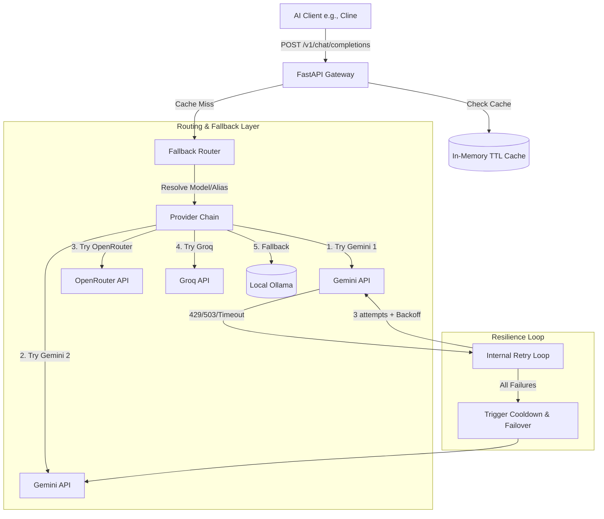

# High-Level Architecture & Design

The LLM Cascade Gateway is a lightweight, stateless, high-availability router and fallback proxy. It exposes an OpenAI-compatible API to local clients (e.g., Cline, Roo Code, Aider) and dynamically manages multiple downstream LLM API providers.

---

## System Architecture

---

## Core Architecture Pillars

### 1. Stateless Context & Message History
The gateway operates **statelessly**. Since AI tools (like Cline) send the complete conversation history (the `messages` list) with every new request:
- **No context is lost** when the gateway shifts traffic from one key or provider to another mid-task.
- The next provider in the fallback chain receives the exact same conversation context and picks up where the previous provider left off.

### 2. Intelligent Routing & Chain Resolution
When a request is received, the router resolves the target model:
- **Model Aliases**: Exposes user-friendly labels (e.g., `coding-fast`, `coding-best`) which map to a configured list of providers in order.
- **Prefix Matching**: Dynamically groups and routes models matching specific prefixes (e.g., `gemini-` starts at Gemini providers; `llama-` starts at Groq/OpenRouter).
- **Load Balancing Strategies**:
  - `priority`: Evaluates providers in the strict order specified in the config. Primary keys are exhausted before secondary fallbacks are called.
  - `round_robin`: Distributes requests evenly across all active healthy providers.
  - `lru` (Least Recently Used): Prioritizes the provider that was used longest ago to spread rate limits evenly.

### 3. Resilience Engine (Internal Provider Retries)
To prevent temporary upstream spikes or quotas from causing unnecessary failovers, the router implements provider-level retry logic:
- **Rate Limits (429)**: Dynamically scans the response body using regular expressions to extract recommended retry delays (e.g., `Please retry in X.Xs` or `"retryDelay": "Xs"`), sleeps for that period (capped at 5s), and retries.
- **Server Overloads (503 / 504)**: Retries up to 3 times with exponential backoff (`1.5 * attempt` seconds).
- **Network Interruptions**: Retries up to 3 times with a flat 1.0s delay.

If all 3 retries fail, the provider is put on **cooldown** (configured to 30 seconds to allow rapid recovery), and the request moves to the next provider in the chain.

### 4. Byte-Level SSE Streaming Passthrough
For streaming requests (`stream: true`), standard SSE events must end with double newlines (`\n\n`) to be parsed correctly by strict client-side event source parsers.
- The gateway uses **raw byte-level chunk forwarding** (`response.aiter_bytes()`). 
- This bypasses line-splitting anomalies during the stream, assuring zero-latency delivery and perfect wire-format compliance.
- Stream parsing for audit logs is deferred to the generator's `finally` block, ensuring no processing latency impacts the user interface.

### 5. Persistent Background Daemon
The application is integrated as a **systemd user service** (`ai-gateway.service`). 
- Starts automatically on user login.
- Runs persistently in the background.
- Recovers automatically upon unexpected crashes.
